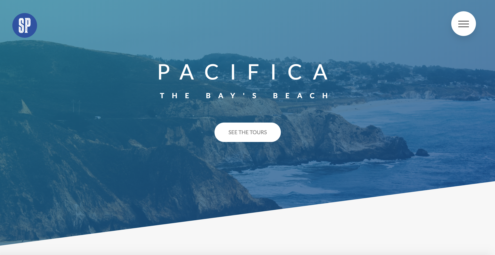

# Pacifica.com

Click [here](https://sashapatsel.github.io/webpage-template-1/) to see the template!

     

This is a modern looking, single-page website showing off some of the coolest features in CSS! 

The general theme for this page is a website for Pacifica, CA. You'll notice though, that some of my warriors fandom found it's way onto the page 🤫. 

This template is packed with cool effects and awesome, reusable components. Check out the demo video below, or test it out for yourself [here](https://sashapatsel.github.io/webpage-template-1/).

## Demo
       
      

## Built With

* HTML
* CSS
* [SASS](https://sass-lang.com/) - CSS Extension
* No JS needed!

## Authors

* **Sasha Patsel** - *Initial work* - [sashapatsel](https://github.com/SashaPatsel)

## License

This project is licensed under the MIT License - see the [LICENSE.md](LICENSE.md) file for details

## Acknowledgments

* [Jonas Shmedtmann](https://www.udemy.com/advanced-css-and-sass/learn/v4/). The majority of this design was inspired by Jonas Shmedtmann's `Natours` project in his advanced CSS course on Udemy. Thanks for the amazing course! 
